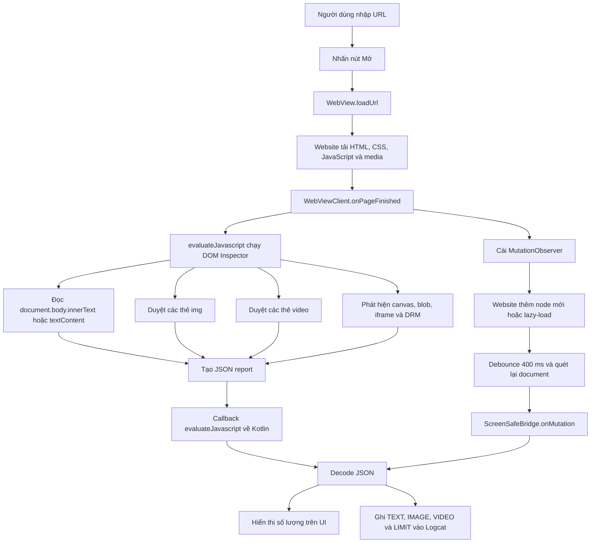

# ScreenSafe — Báo cáo Prototype In-app WebView

## 1. Tổng quan

ScreenSafe hiện là một prototype Android tối giản dùng để kiểm chứng tính khả thi của phương án **In-app WebView**. Mục tiêu của phiên bản này là xác minh rằng ứng dụng Android có thể mở website bên trong `WebView`, chạy JavaScript trong ngữ cảnh của trang và đọc ba nhóm nội dung chính:

- Text trong DOM.
- Ảnh được biểu diễn bởi thẻ ``.
- Video được biểu diễn bởi thẻ `<video>`, bao gồm metadata và khả năng đọc frame trong những trường hợp trình duyệt cho phép.

Prototype không bao gồm AI, backend, tài khoản, database hoặc cơ chế vượt qua CORS/DRM. Những giới hạn bảo mật của trình duyệt được giữ nguyên và được ghi rõ trong Logcat.

## 2. Phạm vi đã thực hiện

Ứng dụng hiện có:

- Một ô nhập URL.
- Nút **Mở** để tải website.
- `WebView` hiển thị website ngay trong ScreenSafe.
- JavaScript và DOM Storage được bật.
- JavaScript inspector chạy bằng `evaluateJavascript()` sau khi trang tải xong.
- Kết quả được gửi về Kotlin, hiển thị tóm tắt trên giao diện và ghi chi tiết trong Logcat.
- Report đầy đủ được lưu tại `Android/data/com.example.screensafe/files/reports/latest_report.json`.
- Nút **Đo audio** dùng Web Audio API để đo RMS/peak khi media đang phát và lưu `latest_audio_probe.json`.
- `MutationObserver` theo dõi nội dung DOM được thêm sau khi trang đã tải, ví dụ lazy loading khi người dùng scroll.
- Kiểm tra giới hạn liên quan đến canvas, Blob URL, iframe, streaming và DRM.
- Điều hướng Back trong lịch sử WebView.

## 3. Cấu trúc chính của project

```text
ScreenSafe/
├── app/
│   ├── build.gradle.kts
│   └── src/main/
│       ├── AndroidManifest.xml
│       ├── java/com/example/screensafe/
│       │   └── MainActivity.kt
│       └── res/
│           ├── layout/activity_main.xml
│           └── values/strings.xml
└── SCRENSAFE_PROTOTYPE_REPORT.md
```

Vai trò của các file:

- `MainActivity.kt`: cấu hình WebView, tải URL, chạy DOM inspector, nhận JSON, ghi Logcat và cài `MutationObserver`.
- `activity_main.xml`: giao diện gồm URL input, nút Mở, trạng thái và WebView.
- `AndroidManifest.xml`: khai báo quyền Internet và cấu hình cleartext phục vụ prototype.
- `strings.xml`: nội dung giao diện.

## 4. Kiến trúc và luồng hoạt động



### 4.1. Luồng tải trang

1. Người dùng nhập URL.
2. Nếu URL chưa có `http://` hoặc `https://`, ứng dụng tự thêm `https://`.
3. `WebView.loadUrl()` tải website.
4. Khi main frame hoàn thành, `onPageFinished()` gọi hàm kiểm tra DOM.
5. JavaScript trả về một chuỗi JSON.
6. Kotlin giải mã chuỗi, phân nhóm kết quả và ghi Logcat.

### 4.2. Thu thập Text

Inspector ưu tiên:

```javascript
document.body.innerText
```

và fallback sang:

```javascript
document.body.textContent
```

Report Text gồm:

- Tổng số ký tự.
- Logcat hiển thị tối đa 500 ký tự mẫu; file JSON lưu tối đa 50.000 ký tự và ghi cờ `truncated` nếu vượt giới hạn.

Text chỉ bao gồm nội dung có trong DOM của trang chính. Chữ nằm trong ảnh, canvas hoặc cross-origin iframe không được đọc bằng phương pháp này.

### 4.3. Thu thập Image

Inspector duyệt tất cả thẻ `` và lấy:

- `currentSrc`, fallback sang `src`.
- URL tuyệt đối dựa trên `document.baseURI`.
- `alt`.
- `naturalWidth` và `naturalHeight`.
- Trạng thái `complete`.

Kotlin ghi tổng số ảnh và tối đa ba phần tử mẫu vào Logcat.

### 4.4. Thu thập Video

Với mỗi thẻ `<video>`, inspector lấy:

- `currentSrc` hoặc `src`.
- `currentTime`.
- `duration`.
- `videoWidth`, `videoHeight`.
- `paused`.
- `readyState`.
- Loại nguồn: URL thường, Blob URL hoặc không có URL trực tiếp.
- Trạng thái `mediaKeys` để nhận biết dấu hiệu Encrypted Media/DRM.

Để kiểm tra khả năng lấy frame, JavaScript tạo một canvas rất nhỏ, gọi:

```javascript
context.drawImage(video, 0, 0, width, height)
context.getImageData(0, 0, 1, 1)
```

Prototype chỉ đọc thử một pixel để xác nhận khả năng truy cập, không gửi toàn bộ bitmap qua JavaScript bridge. Kết quả được biểu diễn bằng:

- `frameReadable = true`: có thể phát triển chức năng lấy frame sau này.
- `frameReadable = false`: video chưa sẵn sàng hoặc canvas bị chặn/tainted do cross-origin, protected media hay DRM.

### 4.5. Theo dõi nội dung động

`MutationObserver` được gắn vào `document.documentElement` với:

```javascript
{ childList: true, subtree: true }
```

Khi website thêm element mới:

1. Observer thu nhận mutation.
2. Hệ thống debounce 400 ms để tránh gửi quá nhiều callback liên tiếp.
3. Toàn bộ document được quét lại để không bỏ sót nhiều sibling node được thêm trong cùng một đợt.
4. JSON được gửi về Kotlin qua `ScreenSafeBridge.onMutation()`.
5. Log được đánh dấu bằng tiền tố `MUTATION`.

## 5. JavaScript bridge và lưu ý bảo mật

Ứng dụng expose một bridge tối giản:

```kotlin
webView.addJavascriptInterface(DomBridge(), "ScreenSafeBridge")
```

Bridge chỉ có một hàm nhận report và không cung cấp quyền truy cập file, token, database hoặc chức năng hệ thống.

Điều này quan trọng vì JavaScript của mọi website được mở trong WebView đều có khả năng nhìn thấy bridge. Nếu mở rộng prototype, không nên đưa các thao tác đặc quyền trực tiếp vào cùng interface này. Với sản phẩm thật nên cân nhắc:

- Chỉ cho phép domain đã được kiểm duyệt.
- Kiểm tra navigation và origin.
- Tách browsing WebView khỏi dữ liệu nhạy cảm của ứng dụng.
- Dùng message channel hoặc cơ chế bridge có phạm vi chặt chẽ hơn nếu phù hợp.
- Không cho phép WebView truy cập file cục bộ nếu không thật sự cần.

## 6. Permission và cấu hình WebView

Manifest khai báo:

```xml
<uses-permission android:name="android.permission.INTERNET" />
```

Prototype đang dùng:

```xml
android:usesCleartextTraffic="true"
```

Cấu hình này cho phép thử nghiệm website HTTP. Bản production nên ưu tiên HTTPS hoặc dùng Network Security Config để chỉ cho phép các domain HTTP thực sự cần thiết.

WebView được cấu hình:

```kotlin
javaScriptEnabled = true
domStorageEnabled = true
loadsImagesAutomatically = true
mediaPlaybackRequiresUserGesture = true
```

## 7. Kết quả kiểm thử thực tế

Prototype đã được build, cài và chạy trên Android emulator `Pixel_7`.

### 7.1. Build

Các task đã chạy thành công:

```text
testDebugUnitTest
assembleDebug
BUILD SUCCESSFUL
```

APK debug:

```text
app/build/outputs/apk/debug/app-debug.apk
```

### 7.2. Kiểm thử Text

Website thử nghiệm:

```text
https://example.com
```

Kết quả:

```text
TEXT: 129 ký tự
IMAGE: 0
VIDEO: 0
```

Nội dung mẫu `Example Domain` được gửi thành công từ JavaScript về Kotlin.

### 7.3. Kiểm thử Image

Website thử nghiệm:

```text
https://www.wikipedia.org
```

Kết quả quan sát:

```text
TEXT: 2.006 ký tự
IMAGE: 7
VIDEO: 0
```

Ví dụ ảnh đọc được:

```text
https://www.wikipedia.org/portal/wikipedia.org/assets/img/Wikipedia-logo-v2@2x.png
naturalWidth: 200
naturalHeight: 183
complete: true
```

### 7.4. Kiểm thử Video và frame

Website thử nghiệm:

```text
https://www.w3schools.com/html/html5_video.asp
```

Kết quả trên giao diện:

```text
TEXT: 4.784 ký tự
IMAGE: 29
VIDEO: 2
LIMIT: 1
```

Metadata video mẫu:

```json
{
  "currentSrc": "https://www.w3schools.com/html/mov_bbb.mp4",
  "currentTime": 0,
  "duration": 10.026667,
  "videoWidth": 320,
  "videoHeight": 176,
  "paused": true,
  "readyState": 4,
  "sourceType": "url",
  "drmMediaKeysPresent": false,
  "frameReadable": true
}
```

Điều này chứng minh trong trường hợp video HTML5 không bị bảo vệ và dữ liệu đã decode, ScreenSafe có thể xác định metadata và đọc pixel của frame thông qua canvas.

Trang cũng chứa iframe và ứng dụng ghi đúng giới hạn:

```text
Iframe found: cross-origin iframe DOM cannot be read due to the same-origin policy.
```

### 7.5. Kiểm thử MutationObserver

Sau khi scroll trang W3Schools, Logcat ghi nhận:

```text
MutationObserver detected new DOM content
[MUTATION][TEXT] chars=4784
[MUTATION][IMAGE] count=29
[MUTATION][VIDEO] count=2
```

Kết quả xác nhận WebView có thể phát hiện và đọc lại DOM sau khi website thêm nội dung động.

### 7.6. File kết quả và audio probe

Report DOM đầy đủ được lưu trên thiết bị tại:

```text
/storage/emulated/0/Android/data/com.example.screensafe/files/reports/latest_report.json
```

Kết quả probe audio được lưu tại `latest_audio_probe.json`. Khi video đang pause, report trả `rms = 0`, `peak = 0` và lý do yêu cầu phát video trước. Khi media đang phát và Web Audio được phép, `nonSilent = true` chứng minh ứng dụng đọc được tín hiệu âm thanh. Raw PCM và DRM bypass không được triển khai.

## 8. Mẫu Logcat

```text
[INITIAL][TEXT] chars=4784, sample=HTML Video...
[INITIAL][IMAGE] count=29
[IMAGE][0] {"src":"https://...","width":230,"height":295}
[INITIAL][VIDEO] count=2
[VIDEO][0] {"currentSrc":"https://.../mov_bbb.mp4", ...}
[INITIAL][LIMIT] Iframe found: cross-origin iframe DOM cannot be read...

MutationObserver detected new DOM content
[MUTATION][TEXT] chars=4784
[MUTATION][IMAGE] count=29
[MUTATION][VIDEO] count=2
```

## 9. Cách chạy ứng dụng

### 9.1. Chạy bằng Android Studio

1. Mở thư mục project ScreenSafe bằng Android Studio.
2. Chờ Gradle Sync hoàn tất.
3. Chọn emulator hoặc kết nối điện thoại thật đã bật USB debugging.
4. Chọn module `app`.
5. Nhấn **Run**.
6. Trong ứng dụng, nhập URL và nhấn **Mở**.
7. Xem số lượng Text/Image/Video trên giao diện.
8. Scroll website để thử nội dung lazy loading và `MutationObserver`.

### 9.2. Build bằng command line trên Windows

```powershell
.\gradlew.bat testDebugUnitTest assembleDebug
```

Nếu biến Gradle home của máy không khả dụng, có thể dùng cache trong project:

```powershell
$env:GRADLE_USER_HOME = Join-Path (Get-Location) '.gradle-local'
.\gradlew.bat testDebugUnitTest assembleDebug
```

### 9.3. Cài APK bằng ADB

```powershell
adb install -r app\build\outputs\apk\debug\app-debug.apk
```

### 9.4. Xem Logcat

Trong Android Studio, mở cửa sổ Logcat và lọc:

```text
tag:ScreenSafe
```

Hoặc dùng ADB:

```powershell
adb logcat -s ScreenSafe
```

## 10. Kịch bản test đề xuất

### Test 1 — Trang chỉ có Text

- Mở `https://example.com`.
- Kỳ vọng `TEXT > 0`.
- Kỳ vọng có sample text trong Logcat.

### Test 2 — Trang có nhiều ảnh

- Mở `https://www.wikipedia.org` hoặc một trang bài viết có ảnh.
- Kỳ vọng `IMAGE > 0`.
- Kiểm tra `src`, `width`, `height`, `complete` trong Logcat.

### Test 3 — HTML5 video trực tiếp

- Mở `https://www.w3schools.com/html/html5_video.asp`.
- Kỳ vọng `VIDEO > 0`.
- Kiểm tra `currentSrc`, `duration`, kích thước và `readyState`.
- Kiểm tra `frameReadable`.

### Test 4 — Nội dung lazy loading

- Mở một website có infinite scroll hoặc ảnh lazy-load.
- Ghi lại số lượng ban đầu.
- Scroll xuống nhiều lần.
- Tìm log `MutationObserver detected new DOM content` và nhóm `MUTATION`.
- So sánh số lượng trước và sau.

### Test 5 — Blob/streaming

- Mở một trang dùng MediaSource hoặc streaming player.
- Kiểm tra `sourceType = blob` hoặc `currentSrc` không có URL trực tiếp.
- Kỳ vọng ứng dụng ghi limit thay vì cố bypass.

### Test 6 — Cross-origin iframe

- Mở trang có iframe nhúng từ domain khác.
- Kỳ vọng có log giới hạn same-origin.
- Không kỳ vọng đọc được DOM nằm bên trong iframe đó từ trang cha.

### Test 7 — DRM/protected media

- Mở dịch vụ video có protected media khi chính sách dịch vụ cho phép mở trong WebView.
- Kiểm tra dấu hiệu `drmMediaKeysPresent`.
- Kỳ vọng không trích xuất hoặc bypass nội dung bảo vệ.

## 11. Kết luận khả thi

| Nhóm | Kết quả | Ghi chú |
|---|---|---|
| Text | Lấy được | Đọc được text tồn tại trong DOM trang chính |
| Image | Lấy được | Đọc được URL và metadata của thẻ `` |
| Video metadata | Lấy được một phần | Phụ thuộc cách website triển khai player |
| Video frame | Lấy được có điều kiện | Thành công với video HTML5 cùng quyền truy cập; có thể bị CORS/DRM chặn |
| Nội dung động | Phát hiện được | `MutationObserver` nhận biết DOM được thêm sau khi tải |
| Cross-origin iframe | Không lấy trực tiếp | Bị giới hạn bởi same-origin policy |
| DRM/protected content | Không lấy | Không bypass cơ chế bảo vệ |

Prototype đã đạt mục tiêu cốt lõi: chứng minh In-app WebView có thể đọc Text, Image và một phần thông tin/khung hình Video trong các điều kiện trình duyệt cho phép.

## 12. Nhược điểm và giới hạn kỹ thuật

### 12.1. Phụ thuộc DOM

- Chỉ đọc được nội dung đang tồn tại trong DOM.
- Không tự nhận dạng chữ nằm trong ảnh hoặc canvas.
- SPA có thể thay đổi hoặc xóa node liên tục.
- Virtualized list thường chỉ giữ các item đang hiển thị, do đó một lần quét không đại diện cho toàn bộ feed.

### 12.2. Same-origin và CORS

- JavaScript của trang cha không đọc được DOM của cross-origin iframe.
- Ảnh hoặc video cross-origin có thể hiển thị được nhưng làm canvas bị tainted.
- URL media không đồng nghĩa với việc ứng dụng được phép tải lại byte của media.

### 12.3. Video streaming

- MediaSource thường tạo `blob:` URL thay vì URL manifest/segment gốc.
- Adaptive streaming có thể đổi segment, codec và chất lượng liên tục.
- `currentSrc` có thể rỗng nếu player chưa khởi tạo hoặc ẩn media sau abstraction riêng.

### 12.4. DRM

- Encrypted Media Extensions và DRM có thể ngăn truy cập pixel/frame.
- Không nên và không được thiết kế để vượt qua DRM.
- Với protected surface, Screen Capture cũng có thể trả về màn hình đen.

### 12.5. Canvas

- Canvas không có cấu trúc semantic như DOM.
- Canvas có dữ liệu cross-origin sẽ bị tainted.
- Đọc canvas lớn hoặc liên tục có thể tốn CPU, GPU và bộ nhớ.

### 12.6. Hiệu năng

- Quét lại toàn bộ document sau mỗi mutation phù hợp với prototype nhưng không tối ưu cho website lớn.
- Website nhiều mutation có thể tạo nhiều report dù đã debounce.
- JSON lớn và bridge JavaScript–Kotlin có chi phí serialize/deserialize.
- Đọc frame thường xuyên có thể gây giật video.

### 12.7. Tính ổn định

- `onPageFinished()` không đảm bảo mọi tài nguyên hoặc SPA data đã tải xong.
- Hành vi phụ thuộc phiên bản Android System WebView.
- Website có thể thay đổi DOM hoặc chặn WebView bằng chính sách riêng.

## 13. Hướng phát triển

### Giai đoạn 1 — Làm prototype ổn định hơn

- Tách JavaScript inspector thành asset `.js` riêng để dễ test và versioning.
- Thêm nút **Quét lại** thay vì chỉ phụ thuộc `onPageFinished()`.
- Cho phép bật/tắt từng nhóm Text/Image/Video.
- Hiển thị danh sách kết quả có cấu trúc ngay trong ứng dụng.
- Thêm timestamp, URL trang và loại report vào mỗi lần quét.
- Deduplicate element bằng ID nội bộ hoặc fingerprint.
- Chỉ xử lý các subtree thực sự thay đổi thay vì luôn quét toàn bộ document.

### Giai đoạn 2 — Chuẩn hóa dữ liệu

- Tạo các Kotlin data class: `TextResult`, `ImageResult`, `VideoResult`, `LimitResult`.
- Dùng Kotlin serialization thay cho đọc `JSONObject` thủ công.
- Chuẩn hóa URL và loại bỏ duplicate.
- Gắn nguồn dữ liệu với DOM selector hoặc XPath có giới hạn.
- Phân biệt visible content và hidden content.

### Giai đoạn 3 — Video frame có kiểm soát

- Chỉ capture khi người dùng chủ động yêu cầu.
- Capture theo interval thấp hoặc theo scene change, không capture mỗi frame.
- Resize frame trước khi truyền về native.
- Truyền dữ liệu qua binary-friendly pipeline thay vì Base64 lớn trong Logcat.
- Đặt giới hạn kích thước, thời gian và bộ nhớ.
- Dừng ngay khi gặp DRM hoặc lỗi security/tainted canvas.

### Giai đoạn 4 — Screen Capture fallback

- Dùng MediaProjection với sự đồng ý rõ ràng của người dùng.
- Chỉ dùng khi DOM/canvas/video không thể truy cập trực tiếp.
- Hiển thị trạng thái recording/capture minh bạch.
- Tuân thủ `FLAG_SECURE`, DRM và chính sách nền tảng.
- Bổ sung crop theo vùng WebView và OCR nếu mục tiêu sau này yêu cầu đọc chữ từ hình ảnh.

### Giai đoạn 5 — Bảo mật và production hardening

- Domain allowlist hoặc cảnh báo với domain chưa tin cậy.
- Chặn `file://`, intent URL và custom scheme không mong muốn.
- Xử lý SSL errors an toàn; không bỏ qua certificate warning.
- Tắt cleartext traffic mặc định.
- Thiết lập Safe Browsing và navigation policy.
- Không lưu cookie/lịch sử nếu không cần.
- Có chính sách riêng tư rõ ràng nếu nội dung trang được phân tích hoặc gửi ra ngoài thiết bị.

### Giai đoạn 6 — Kiểm thử tự động

- Tạo trang HTML fixture cục bộ có Text, Image, Video, Canvas, iframe và DOM lazy-load.
- Instrumentation test WebView bằng Espresso-Web.
- Test nhiều Android API level và nhiều phiên bản System WebView.
- Test mất mạng, redirect, timeout, SSL error và trang có JavaScript lỗi.
- Benchmark thời gian quét và dung lượng report trên DOM lớn.

## 14. Tiêu chí cho phiên bản tiếp theo

Một phiên bản prototype tiếp theo có thể được coi là đạt khi:

- Kết quả được biểu diễn bằng model Kotlin rõ ràng, không chỉ Logcat.
- MutationObserver chỉ gửi element mới hoặc element thay đổi.
- Có fixture test ổn định, không phụ thuộc hoàn toàn vào website bên ngoài.
- Có nút quét thủ công và trạng thái lỗi dễ hiểu.
- Frame extraction có giới hạn tần suất/kích thước.
- Navigation và JavaScript bridge được harden trước khi thử với dữ liệu nhạy cảm.

## 15. Tóm tắt

ScreenSafe đã chứng minh được nền tảng kỹ thuật của phương án In-app WebView:

1. Website có thể được mở và tương tác ngay trong ứng dụng.
2. Text và Image trong DOM có thể được thu thập đáng tin cậy ở mức prototype.
3. Video metadata có thể được đọc; frame có thể truy cập trong trường hợp video không bị CORS/DRM chặn.
4. Nội dung được thêm động có thể được phát hiện bằng `MutationObserver`.
5. Các giới hạn trình duyệt được nhận diện và ghi log thay vì bypass.

Kết quả phù hợp để tiếp tục sang giai đoạn chuẩn hóa dữ liệu, tối ưu mutation processing, thử nghiệm frame extraction có kiểm soát và nghiên cứu Screen Capture làm fallback.
